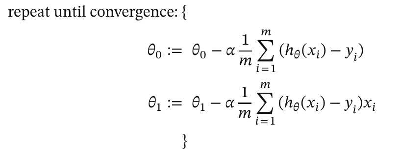

# Gradient Descent

- Have some functuion J(O(0), O(1))
- Want min J(O(0), O(1))

Outline:
- Start with some O(0), O(1)
- Keep changing O(0), O(1) to reduce J(O(0), O(1)) until we hopefully end up at a minimum

## Gradient Descent applied to a Linear Regression cost function

> **Explanation**
>
> `repeat until convergence {` : Keep repeating the following steps until the values of the parameters (θ₀, θ₁) stop changing significantly (convergence is reached).
> 
> `θⱼ` : The parameter being updated.
> 
> `:=` : Assignment. `a := b` means that `a` now has value of `b`. Not to be confused with `a = b`, which is a truth assertion.
> 
> `α` : The **learning rate**. A small positive value that controls the size of the update step.
> `∂` : Partial derivative. It means we're taking the derivative of a function with respect to one variable, while keeping the others constant.
> 
> `∂/∂θⱼ J(θ₀, θ₁)` : The partial derivative of the cost function J(θ₀, θ₁) with respect to θⱼ. In other words, how much the cost would change if we nudged θⱼ slightly.

> **Extra: Derivatives**
>
> **Derivatives** are measurements of how much a function changes when its input changes. It is the rage of change of a function. This is used in machine learning to figure out how to adjust parameters to minimize error and improve predictions.

## Gradient Descent for Linear Regression

When specifically applied to the case of linear regression, a new form of the gradient descent equation can be derived. We can substitute our **actual cost function** and our **actual hypothesis function** and modify the equation to:

> **Extra: "Batch" Gradient Descent**
>
> Each step of gradient descent uses all the training examples.