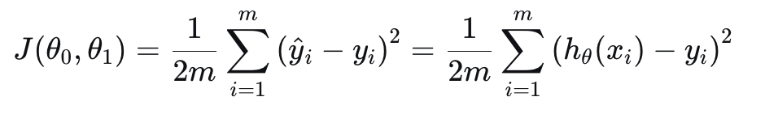

# Cost Function

We can measure the accuracy of our hypothesis by using a **cost function**. This takes an average difference (actually a fancier version of an average) of all the results of the hypothesis with inputs from x's and the actual output y's.

To break it apart, it is 1/2 x where x is the mean of the squares of hθ(xi) - yi, or *the difference between the predicted value and the actual value*.

This function is othwerise called the "**Squared error function**" or "**Mean squared error**". The mean is halved (1/2) as a convenience for the computation of the gradient descent, as the derivative term of the square function will cancel out the 1/2 term.

> Squaring the errors do two things:
> 
> 1. Negative errors cancel out positive ones
> 
> If you just summed the raw errors, they could cancel out: `(+5000) + (-5000) = 0`. This would look like perfect accuracy.
> 
> By squaring it we avoid this problem: `(+5000)^2 + (-5000)^2 = 25.000.000 + 25.000.000 = 50.000.000`
> 
> 2. Penalize bigger mistakes more
> 
> Squaring means big errors hurt more than small ones.
`(10)^2 = 100, (100)^2 = 10.000`.

Imagine you have a dataset of housing prices. The y column is the price, and x column the area of the house. If you plot it on a 2D graph, you can plot a straight line in order to make a prediction of how much a house will cost depending on the total area size. 

- The X's are actual houses with y price and x area.
- The hypothesis draws the prediction line.
- The cost function is the "accuracy", in other words, how far off the hypothesis line is from the actual value.