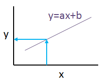

# Linear Regression

Linear regression attempst to model the relationship between two variables by fitting a linear equation to observer data.
One variable is considered to be an **explanatory variable**, and the other to be a **dependent variable**.

- **linear:** a relationship or equation that can be represented by a straight line on a graph
- **regression:** a measure of the relation between the mean value of one variable and corresponding values of other variables
- **explanatory variable:** explains, predicts or influence the value of another variable.
- **dependent variable**: the variable that is being measured or tested in an experiment.

> It should take the form of this equation:
> *Y = aX + b*
>
> Where *X* is the explanatory variable and *Y* is the dependent variable.
> The slope of the line is *a*, and *b* is the intercept (the value of *Y* when *X = 0*).

> Source: http://www.stat.yale.edu/Courses/1997-98/101/linreg.htm